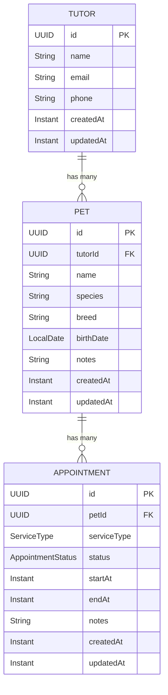

# Domain Model
{: .no_toc }

The core business domain of PetWise: tutors, pets, and appointments.
{: .fs-6 .fw-300 }

## Table of contents
{: .no_toc .text-delta }

1. TOC
{:toc}

---

## Overview

PetWise follows **Domain-Driven Design** principles with three main aggregates:

1. **Tutor** — Pet owner or guardian (Aggregate Root)
2. **Pet** — Animal under care (Entity inside Tutor aggregate)
3. **Appointment** — Scheduled daycare or hotel service (Aggregate Root)

---

## Entities

### Tutor

**Purpose:** Represents a pet owner or guardian.

**Attributes:**
- `id: TutorID` — Unique identifier (generated UUID)
- `name: String` — Required, non-empty
- `email: Email` — Optional, must be valid format if provided
- `phone: Phone` — Optional, must be valid format if provided
- `createdAt: Instant` — Creation timestamp
- `updatedAt: Instant` — Last update timestamp

**Business Rules:**
- Name cannot be empty
- Email must be valid format (if provided)
- Phone must be valid format (if provided)
- Cannot be deleted while pets exist

---

### Pet

**Purpose:** Represents an animal under care, linked to a tutor.

**Attributes:**
- `id: PetID` — Unique identifier (generated UUID)
- `tutorId: TutorID` — Required, reference to owner
- `name: String` — Required, non-empty
- `species: String` — Optional
- `breed: String` — Optional
- `birthDate: LocalDate` — Optional, cannot be in the future
- `notes: String` — Optional
- `createdAt: Instant` — Creation timestamp
- `updatedAt: Instant` — Last update timestamp

**Business Rules:**
- Name cannot be empty
- Must belong to exactly one tutor
- Birth date cannot be in the future (if provided)
- Cannot be deleted while ACTIVE appointments exist

---

### Appointment

**Purpose:** Represents a scheduled daycare or hotel service for a pet.

**Attributes:**
- `id: AppointmentID` — Unique identifier (generated UUID)
- `petId: PetID` — Required, reference to pet
- `serviceType: ServiceType` — Required (CRECHE or HOTEL)
- `status: AppointmentStatus` — Required, follows lifecycle
- `startAt: Instant` — Required, start of service window
- `endAt: Instant` — Required, end of service window
- `notes: String` — Optional
- `createdAt: Instant` — Creation timestamp
- `updatedAt: Instant` — Last update timestamp

**Status Lifecycle:**

```
PENDING → ACTIVE → COMPLETED
PENDING → CANCELED
```

**Business Rules:**
- Pet must exist
- `startAt` must be before `endAt`
- Status transitions must follow forward-only lifecycle
- No overlapping PENDING/ACTIVE appointments for the same pet
- COMPLETED and CANCELED are terminal states

---

## Value Objects

### Email

Encapsulates email validation. Must match a valid format regex. Optional — `null` or blank values are accepted.

### Phone

Encapsulates phone number validation. Must match a valid format regex. Optional — `null` or blank values are accepted.

### ServiceType

Enumerates the types of service:
- `CRECHE` — Daycare
- `HOTEL` — Hotel/boarding

### AppointmentStatus

Represents appointment lifecycle state:
- `PENDING` — Created, not yet started
- `ACTIVE` — Pet is currently in service
- `COMPLETED` — Service finished
- `CANCELED` — Appointment canceled before completion

### AppointmentSearchQuery

Immutable query object for the daily agenda. Captures the required `date`, optional `status` and `serviceType` filters, and standard pagination parameters (`page`, `perPage`, `sort`, `direction`).

---

## Entity Relationships



---

## Glossary

| Term | Definition |
|:-----|:-----------|
| **Tutor** | Pet owner or guardian |
| **Pet** | Animal under care at the daycare/hotel |
| **Appointment** | Scheduled daycare or hotel service for a pet |
| **Aggregate Root** | Consistency boundary in DDD (Tutor, Appointment) |
| **Entity** | Domain object with unique identity (Pet) |
| **Value Object** | Immutable object without identity (Email, Phone, ServiceType, AppointmentStatus, AppointmentSearchQuery) |
| **Gateway** | Port interface for persistence operations |

---

## Related

- [Architecture Decision Records](decisions) — Design choices
- [Use Cases](../use-cases) — How the domain is used
- [API Reference](../api-reference) — REST API for domain operations
