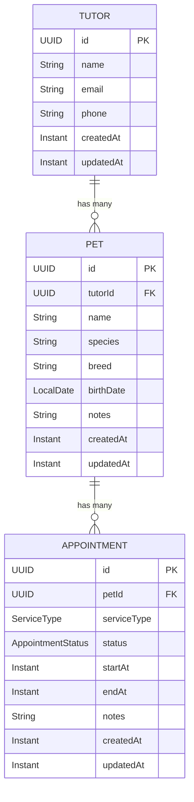

# Domain Model
{: .no_toc }

The core business domain of PetWise: tutors, pets, and appointments.
{: .fs-6 .fw-300 }

## Table of contents
{: .no_toc .text-delta }

1. TOC
{:toc}

---

## Aggregates & Entities

### Tutor (Aggregate Root)

| Attribute | Type | Notes |
|:----------|:-----|:------|
| `id` | `TutorID` (UUID) | Generated |
| `name` | String | Required |
| `email` | Email | Optional, validated |
| `phone` | Phone | Optional, validated |
| `createdAt` | Instant | Auto-set |
| `updatedAt` | Instant | Auto-set |

Cannot be deleted while pets exist (BR-T04).

### Pet (Entity inside Tutor)

| Attribute | Type | Notes |
|:----------|:-----|:------|
| `id` | `PetID` (UUID) | Generated |
| `tutorId` | `TutorID` | Required FK |
| `name` | String | Required |
| `species` | String | Optional |
| `breed` | String | Optional |
| `birthDate` | LocalDate | Optional, not in the future |
| `notes` | String | Optional |
| `createdAt` | Instant | Auto-set |
| `updatedAt` | Instant | Auto-set |

Cannot be deleted while ACTIVE appointments exist (BR-P03).

### Appointment (Aggregate Root)

| Attribute | Type | Notes |
|:----------|:-----|:------|
| `id` | `AppointmentID` (UUID) | Generated |
| `petId` | `PetID` | Required FK |
| `serviceType` | ServiceType | DAYCARE or HOTEL |
| `status` | AppointmentStatus | Follows lifecycle |
| `startAt` | Instant | Required, must be < endAt |
| `endAt` | Instant | Required |
| `notes` | String | Optional |
| `createdAt` | Instant | Auto-set |
| `updatedAt` | Instant | Auto-set |

**Status lifecycle:**

```
PENDING → ACTIVE → COMPLETED
PENDING → CANCELED
```

---

## Entity Relationships



### Auto-Generated ERD

For an ERD derived from the live database schema (always accurate), run:

```bash
make infra-up   # start PostgreSQL
make erd         # generate ERD via SchemaSpy
```

The output is an interactive HTML report at `docs/erd/index.html`.

---

## Related

- [Business Rules & Glossary](domain/business-rules) — All invariants and domain terms
- [Architecture Decision Records](decisions) — Design choices
- [Use Cases](../use-cases) — How the domain is used
