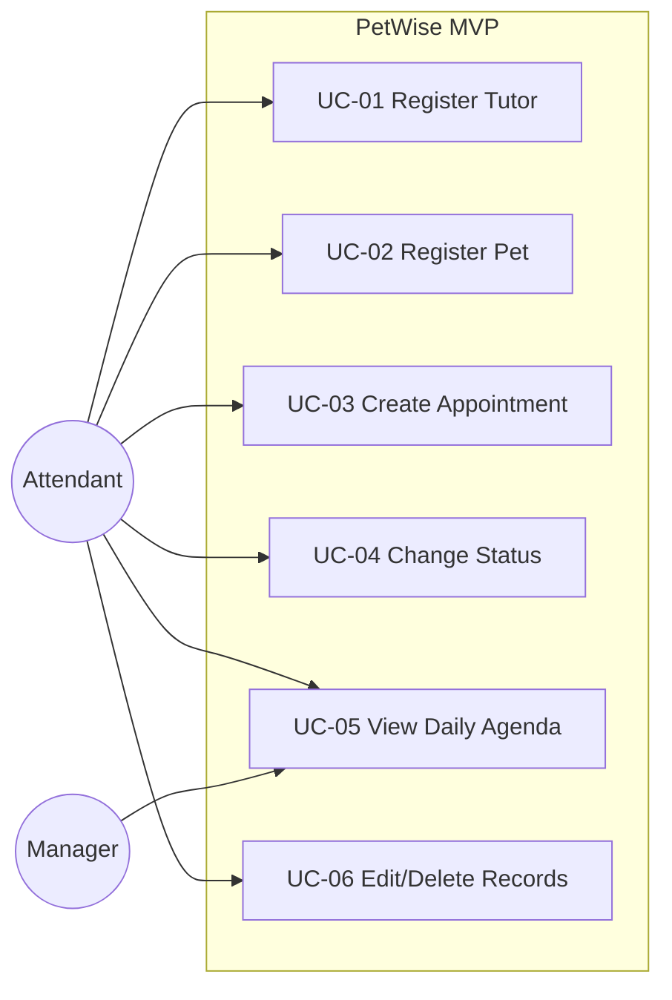

# Use Cases

PetWise implements six core use cases covering tutor management, pet registration, and appointment scheduling.

Each use case is documented with:
- Goal and primary actors
- Main flow and alternative flows
- Preconditions and postconditions
- Application layer mapping
- Related artifacts (API endpoints, business rules)

---

## Overview

### Tutor & Pet Management

- **[UC-01: Register Tutor](use-cases/uc-01-register-tutor)** — Create new tutor records
- **[UC-02: Register Pet](use-cases/uc-02-register-pet)** — Associate pets with tutors
- **[UC-06: Edit/Delete Records](use-cases/uc-06-edit-delete-records)** — Update or remove tutors and pets

### Appointment Management

- **[UC-03: Create Appointment](use-cases/uc-03-create-appointment)** — Schedule daycare or hotel services
- **[UC-04: Change Appointment Status](use-cases/uc-04-change-appointment-status)** — Manage appointment lifecycle
- **[UC-05: View Daily Agenda](use-cases/uc-05-view-daily-agenda)** — Date-filtered appointment listing

---

## Use Case Diagram

---

## Use Case Template

A [use case template](use-cases/specs/uc-template) is available for documenting new use cases.

---

## Implementation Status

UC-01 through UC-06
{: .label .label-green }
Implemented
